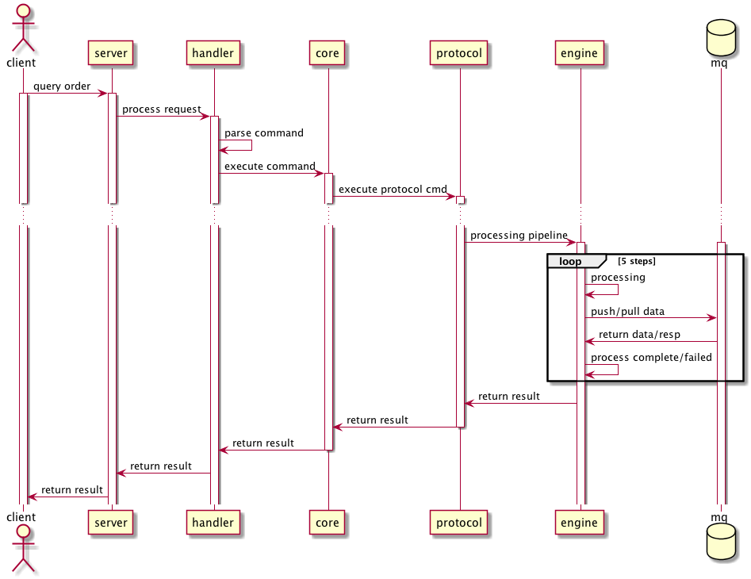
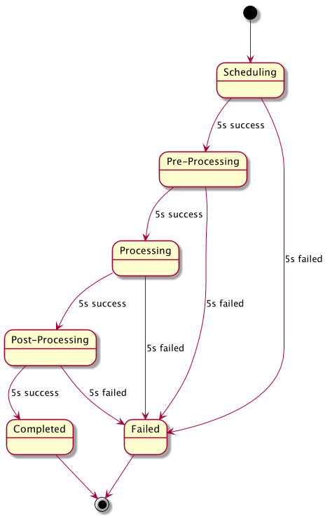

# Order-Sys
Order-sys is a prototype of orders processing system. This prototype is implemented as a CLI
application and will not expose any REST APIs. The architecture of this app consists of two roles:
1. Client
2. Server

Client and Server communicate with each other via thru Netty client-server pattern. To simplify
the design and implementation, order is not serialized and persisted into database, but just serialized
into redis. And to simplify the node implementation, server node is simulate by thread.

In the prototype transaction is partially supported via redis transaction. 

## Path I

The sequence diagram is shown as below:

Client supports two simple commands:

* submit
* query

*submit* is dedicated to submit a new order, the command format is`submit <userId> <order amount>`. Once order is submitted, it will be persisted into redis *stage* queue to wait for processing. The processing state change looks like:

### Code structure

**com.ebay.chris.server.BlueServer* simulates a server that keeps on listening and accepting incoming requests.

*com.ebay.chris.server.BlueServerHandler* is responsible for request parsing and invoking core processing functionalities. The core processing functionalities is implemented in class *com.ebay.chris.server.OrderCore*. The core method is *public String execute(String[] contents)*. While invoked, it will execute biz logic according to request type. 

*com.ebay.chris.common.Protocol* defines the protocol between server and client. 

*com.ebay.chris.server.Engine* defines a state machine of order processing. After server starting, there will be a thread created to process queued order in async mode. The thread simulates a loop processor node polling order continously for further processing.

*com.ebay.chris.server.Proxy* is dedicated for cluster managment. Cluster managment proxy provides following functionalities with redis as a service registry and found service:

* servers registry
* servers reload
* servers remove
* servers cleanup
* server routing

The cluster feature has not been implemented yet. In my mind, the proxy will plays as a frontend of each backend server, and pickup a server to process the request. A fully cluster functionality is very complex, in fact we can implement the whole project as a web service and using third party cluster management systeme to coordinate.

## Path II

As mentioned in former text, the system could be implemented as a HTTP/RPC service with third party cluster cooridnate system. Briefly, we can implment order system as a web service, and store its service status into zookeeper as a ephemeral node. And with a backend batch service subscribing the cluster info, once the server failed, the batch service could resend request to any processing node alive to process the idle orders again.

In reality, this path is adopted in many production enviornments. And it simplifies the whole project from complex logic of cluster managment.

